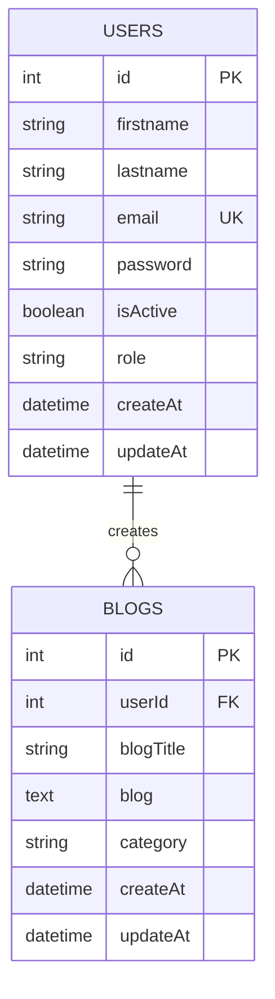

# 📝 Blog Database Management System

A console-based Blog Database Management System built for **Batch 19 — Database Project**, demonstrating relational database design, Sequelize ORM usage, and role-based access control (User / Reader / Admin) entirely from the terminal.

<p align="center">
  
  
  
  
</p>

---

## 📖 Table of Contents

- [Project Overview](#-project-overview)
- [Features](#-features)
- [Tech Stack](#-tech-stack)
- [Database Design](#-database-design)
- [Database Schema](#-database-schema)
- [Project Structure](#-project-structure)
- [Installation & Setup](#-installation--setup)
- [Environment Variables](#-environment-variables)
- [Running the Application](#-running-the-application)
- [User Journey](#-user-journey)
- [Reader Journey](#-reader-journey)
- [Admin Journey](#-admin-journey)
- [Security / Authorization](#-security--authorization)
- [Important Functions](#-important-functions)
- [Testing / Verification](#-testing--verification)
- [Demo Video](#-demo-video)
- [Git Ignore](#-git-ignore)
- [GitHub Submission](#-github-submission)
- [Author](#-author)

---

## 📌 Project Overview

This project is a **console-based** Blog Database Management System (no web/HTTP layer) built with **Node.js**, **JavaScript**, **Sequelize**, and **MySQL**.

It supports three journeys:

- **Users** can register, log in, and fully manage their own blogs (create, search, update, delete).
- **Readers** can view every blog in the system without logging in.
- **Admins** can manage all users and all blogs, including activating/deactivating accounts.

All interaction happens through a text-based menu in the terminal — there is no REST API or frontend, by design.

---

## ✨ Features

### User Features
- Register a new account (`firstname`, `lastname`, `email`, `password`)
- Login with email/password
- Automatic display of the logged-in user's blog titles right after login (or `No blogs are found`)
- Create multiple blogs
- Search own blogs by exact **Blog ID** or by **title** (case-insensitive, partial match)
- Update own blog by ID (leave a field blank to keep its current value)
- Delete own blog by ID
- Logout (clears in-memory session)

### Reader Features
- View **all blogs from all users** without logging in (`View All Blogs` on the main menu)
- Each blog listing includes the author's name and safe author info

### Admin Features
- View the complete user list (`View All Users`)
- View every blog from every user (`View All Blogs`, admin view)
- Search any blog in the system by ID or title (case-insensitive)
- Update any user's `isActive` status (activate/deactivate)
- Delete any user (their blogs are removed first to preserve referential integrity)
- Delete any blog regardless of owner
- Logout back to the main menu

---

## 🛠 Tech Stack

| Technology | Purpose |
|---|---|
| **Node.js** | JavaScript runtime for the console application |
| **JavaScript** | Application language |
| **MySQL** | Relational database engine |
| **Sequelize** | ORM — models, associations, queries, timestamps |
| **mysql2** | MySQL driver used by Sequelize |
| **dotenv** | Loads database configuration from `.env` |

*(Only packages actually present in `package.json` are listed above.)*

---

## 🗄 Database Design

Database name: **`blogdb`**

- `users` and `blogs` are the only two tables.
- One user can own many blogs — a classic **one-to-many** relationship.
- `blogs.userId` is a **foreign key** referencing `users.id`.
- Both tables use custom timestamp column names required by the assignment: **`createAt`** and **`updateAt`** (not Sequelize's default `createdAt`/`updatedAt`).



**Defaults & constraints:**
- `users.isActive` defaults to `true`
- `users.role` defaults to `'user'` (an `'admin'` role is assigned manually, never through registration)
- `users.email` is unique
- `blogs.userId` is a required foreign key pointing to `users.id`

---

## 🧱 Database Schema

### `users`

| Column | Type | Constraints |
|---|---|---|
| `id` | INTEGER | Primary key, auto-increment |
| `firstname` | VARCHAR | Not null |
| `lastname` | VARCHAR | Not null |
| `email` | VARCHAR | Not null, **unique** |
| `password` | VARCHAR | Not null (SHA-256 hash, never plaintext) |
| `isActive` | BOOLEAN | Default `true` |
| `role` | VARCHAR | Default `'user'` |
| `createAt` | DATETIME | Set automatically on creation |
| `updateAt` | DATETIME | Set automatically on update |

### `blogs`

| Column | Type | Constraints |
|---|---|---|
| `id` | INTEGER | Primary key, auto-increment |
| `userId` | INTEGER | Not null, **foreign key → `users.id`** |
| `blogTitle` | VARCHAR | Not null |
| `blog` | TEXT | Not null (blog content/body) |
| `category` | VARCHAR | Not null |
| `createAt` | DATETIME | Set automatically on creation |
| `updateAt` | DATETIME | Set automatically on update |

---

## 📁 Project Structure

```text
Assignment 4/
├── src/
│   ├── app.js                     # Entry point, menus, routing
│   ├── config/
│   │   └── database.js            # Sequelize connection
│   ├── models/
│   │   ├── User.js
│   │   ├── Blog.js
│   │   └── index.js                # Associations (User ↔ Blog)
│   ├── services/
│   │   ├── userService.js          # register / login business logic
│   │   ├── blogService.js          # blog CRUD + allBlog()
│   │   ├── adminService.js         # admin-only operations
│   │   └── session.js              # in-memory current-user session
│   ├── cli/
│   │   ├── authPrompts.js          # register()/login() console flow
│   │   ├── blogPrompts.js          # user + reader console flow
│   │   └── adminPrompts.js         # admin console flow
│   └── utils/
│       ├── password.js             # SHA-256 hash/verify
│       ├── validators.js           # email/string validation
│       └── prompt.js               # readline wrapper
├── .env.example
├── .gitignore
├── package.json
├── package-lock.json
└── README.md
```

---

## ⚙️ Installation & Setup

1. **Clone the repository** (once pushed to a GitHub remote), or copy this `Assignment 4` folder locally.

2. **Enter the project folder**
   ```bash
   cd "Assignment 4"
   ```

3. **Install dependencies**
   ```bash
   npm install
   ```

4. **Create your `.env` file** from the provided template
   ```bash
   cp .env.example .env
   ```

5. **Configure your local MySQL credentials** by editing `.env` (see [Environment Variables](#-environment-variables) below).

6. **Start the application**
   ```bash
   npm start
   ```

---

## 🔑 Environment Variables

Defined in `.env.example`:

| Variable | Description | Example |
|---|---|---|
| `DB_HOST` | MySQL server host | `localhost` |
| `DB_PORT` | MySQL server port | `3306` |
| `DB_NAME` | Database name used by the app | `blogdb` |
| `DB_USER` | MySQL username | `your_mysql_user` |
| `DB_PASSWORD` | MySQL password | `your_mysql_password` |

> ⚠️ `.env` is git-ignored. Never commit real credentials — only `.env.example` (with placeholder values) is tracked in the repository.

---

## ▶️ Running the Application

```bash
npm start
```

This runs `node src/app.js`, which on startup:

1. Connects to MySQL and creates the `blogdb` database if it doesn't already exist.
2. Authenticates the Sequelize connection (`Database connected successfully`).
3. Synchronizes the `users` and `blogs` tables via `sequelize.sync()` — **non-destructive**, it will not drop or reset existing data (`blogdb database synchronized successfully`).
4. Opens the interactive **Main Menu** in the console.

---

## 🧑 User Journey

```
===== MAIN MENU =====
1. View All Blogs
2. Login
3. Register
4. Exit
```

```
Register
   ↓
Login
   ↓
Blogs auto-displayed
  ("No blogs are found" OR list of blog titles)
   ↓
===== USER MENU =====
1. View Your Blogs
2. Search Blog by ID/Title
3. Create Blog
4. Update Blog
5. Delete Blog
6. Logout
   ↓
Logout → back to MAIN MENU
```

Key console messages:
- `User registered successfully`
- `Login successful. Welcome, <firstname>!`
- `No blogs are found`
- `Blog created successfully`
- `No matching blog found`
- `Blog updated successfully` / `Blog not found` / `You can only update your own blog`
- `Blog deleted successfully` / `You can only delete your own blog`
- `Logged out successfully.`

---

## 📰 Reader Journey

- **No login required.**
- From the **Main Menu**, select `1. View All Blogs` — this calls `allBlog()`.
- Every blog from every user is displayed, including the author's name.
- If the `blogs` table is empty, it prints `No blogs are found` instead of erroring.

---

## 🛡 Admin Journey

An admin logs in through the same Login flow; the app routes to the **Admin Menu** based on `currentUser.role === 'admin'`.

```
===== ADMIN MENU =====
1. View All Users
2. View All Blogs
3. Search Blog by ID/Title
4. Update User
5. Delete User
6. Delete Blog
7. Logout
```

- **View All Users** → `allUsers()` — lists every user (safe fields only, no password).
- **View All Blogs** → `allUsersBlog()` — lists every blog with author info.
- **Search Blog by ID/Title** → `searchAnyBlog()` — accepts a blog ID or a case-insensitive title match, searches the entire table, not scoped to one user.
- **Update User** → `updateUserStatus()` — sets a target user's `isActive` to true/false (their `role` is never touched by this operation).
- **Delete User** → `deleteUser()` — deletes the user's blogs first, then the user, to avoid orphaned rows / FK violations.
- **Delete Blog** → `deleteAnyBlog()` — deletes any blog regardless of owner.
- **Logout** → clears session, returns to the Main Menu.

**Deactivation flow:** if an admin sets a user's `isActive` to `false`, that user's next login attempt prints exactly:

```
User is deactivated
```

Reactivating (`isActive = true`) restores normal login.

---

## 🔐 Security / Authorization

- Passwords are hashed with **Node.js's built-in `crypto` module using SHA-256** (`src/utils/password.js`) — **not** bcrypt/bcryptjs, and never stored or displayed in plaintext.
- A normal user can only update or delete **their own** blogs — enforced by comparing `blog.userId === currentUser.id` in `blogService.js`, never by trusting a client-supplied `userId`.
- Every admin-only function in `adminService.js` calls an internal `requireAdmin()` guard that re-checks `getCurrentUser().role === 'admin'` from the live session — this means the check cannot be bypassed by calling a service function directly, only by actually holding an admin session.
- A deactivated user (`isActive = false`) cannot log in — `loginUser()` blocks it before password verification and prints `User is deactivated`.
- User listings (`allUsers()`) and blog-with-author listings (`allUsersBlog()`, `allBlog()`) use Sequelize attribute allow-listing to fetch only `id, firstname, lastname, email` (plus `isActive`/`role`/timestamps for the user list) — **`password` is never selected or displayed**.

---

## 🧩 Important Functions

| Function | Location | Purpose |
|---|---|---|
| `registerUser()` | `services/userService.js` | Validates input, hashes password, creates a new user |
| `loginUser()` | `services/userService.js` | Verifies credentials, blocks deactivated users |
| `createBlog()` | `services/blogService.js` | Creates a blog owned by the given `userId` |
| `getBlogsByUserId()` | `services/blogService.js` | Fetches all blogs owned by a specific user |
| `searchBlogsForUser()` | `services/blogService.js` | Searches a user's own blogs by ID or case-insensitive title |
| `findBlogById()` | `services/blogService.js` | Fetches a single blog by primary key |
| `updateBlog()` | `services/blogService.js` | Updates a blog after verifying ownership |
| `deleteBlog()` | `services/blogService.js` | Deletes a blog after verifying ownership |
| `allBlog()` | `services/blogService.js` | Reader journey — lists every blog with author info, no login required |
| `allUsers()` | `services/adminService.js` | Admin — lists every user (safe fields only) |
| `allUsersBlog()` | `services/adminService.js` | Admin — lists every blog with author info |
| `searchAnyBlog()` | `services/adminService.js` | Admin — finds any blog by ID or case-insensitive title, unrestricted by owner |
| `updateUserStatus()` | `services/adminService.js` | Admin — toggles a user's `isActive` flag only |
| `deleteUser()` | `services/adminService.js` | Admin — removes a user's blogs, then the user |
| `deleteAnyBlog()` | `services/adminService.js` | Admin — deletes any blog regardless of owner |

---

## 🧪 Testing / Verification

All three journeys were manually tested end-to-end against a real local MySQL `blogdb` instance (not an automated test suite — this is a console database project, not a Mocha/Jest project). Verified scenarios included:

- Registration (including duplicate-email rejection and invalid-email rejection)
- Login with correct credentials
- Login with an incorrect password
- Deactivated-user login blocked with the exact `User is deactivated` message
- Creating multiple blogs under one user
- Searching own blogs by exact ID, exact title, partial title, and case-insensitive title
- Updating own blog (partial update, leaving fields unchanged)
- Deleting own blog
- Authorization check: a user attempting to update/delete another user's blog is correctly rejected
- Reader viewing all blogs without logging in, including an empty-database case
- Admin listing all users
- Admin listing all blogs with author info
- Admin searching a blog by ID and by case-insensitive title (found and not-found cases)
- Admin deactivating and reactivating a user, confirmed via a full login retry cycle
- Admin deleting a blog
- Admin deleting a user together with that user's blogs, confirmed no orphaned rows remained
- A normal (non-admin) user blocked from admin operations, both via the menu routing and by attempting to call an admin service function directly
- Logout clearing the in-memory session

---

## 🎥 Demo Video

The complete project demonstration is available below:

[▶️ Watch the Full Demo Video on YouTube](https://youtu.be/yEAQjIs2IEs)

The video demonstrates the complete User Journey, Reader Journey, and Admin Journey with Bangla voice explanation.

---

## 🚫 Git Ignore

`node_modules/` and `.env` are excluded from version control so dependencies and local secrets are never committed:

```gitignore
node_modules
.env
```

---

## 📤 GitHub Submission

Repository: [github.com/almahmudjoy/database-project](https://github.com/almahmudjoy/database-project)

```bash
git add .
git commit -m "Your commit message"
git push
```

---

## 👨‍💻 Author

**Abdullah Al Mahmud Joy**

- Full Stack SDET — Road to SDET
- M.Sc. in Computer Science & Engineering, Military Institute of Science and Technology (MIST)
- B.Sc. in Computer Science & Engineering, Bangladesh University of Business and Technology (BUBT)
- **GitHub:** [github.com/almahmudjoy](https://github.com/almahmudjoy)
- **LinkedIn:** [linkedin.com/in/abdullah-al-mahmud-joy](https://linkedin.com/in/abdullah-al-mahmud-joy/)
